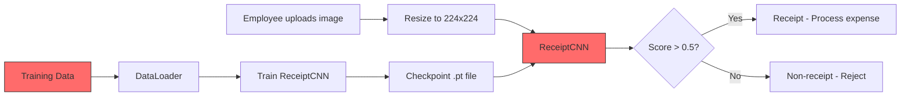
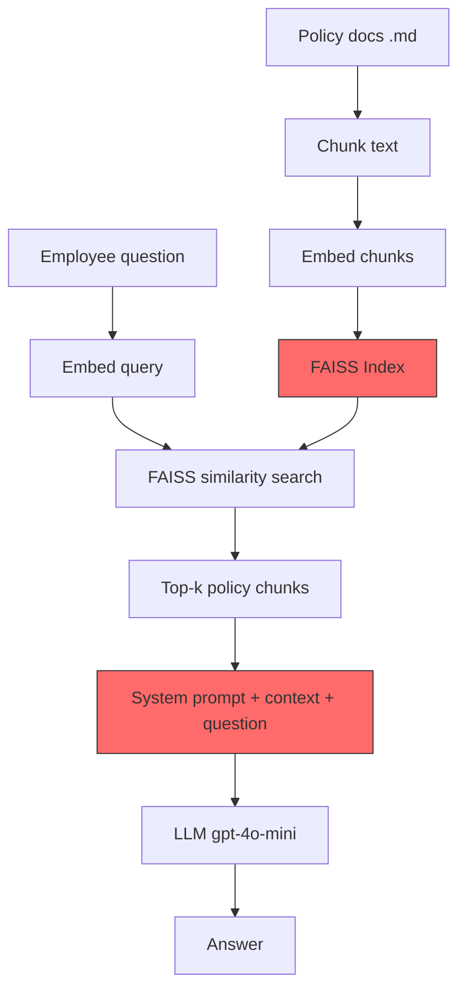
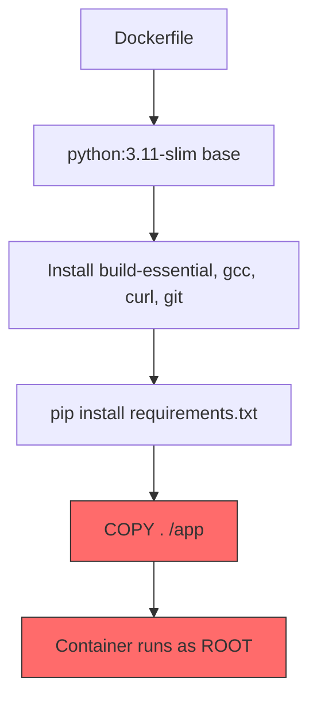

# System Architecture

## Overview

FinanceGuard's AI infrastructure consists of two primary systems with distinct attack surfaces.

## Receipt Classifier



**Attack Surfaces:**
- **Model input (FGSM):** Adversarial perturbations to input images can flip predictions
- **Training data (Poisoning):** Corrupted labels in training data degrade model accuracy

### Model Architecture

```
ReceiptCNN:
  Conv2d(3→16) → BatchNorm → ReLU → MaxPool    # 224→112
  Conv2d(16→32) → BatchNorm → ReLU → MaxPool    # 112→56
  Conv2d(32→64) → BatchNorm → ReLU → MaxPool    # 56→28
  GlobalAvgPool                                   # 28→1
  Dropout(0.3)
  Linear(64→32) → ReLU
  Linear(32→1) → Sigmoid                         # Binary output
```

- **Input:** 224×224 RGB image
- **Output:** Score in [0, 1] — receipt if > 0.5
- **Loss:** BCELoss
- **Parameters:** ~26K (lightweight custom CNN)

## RAG Chatbot



**Attack Surfaces:**
- **Vector store (Exfiltration):** FAISS has no access control — any semantically similar query retrieves any document, including confidential ones
- **System prompt (Injection):** The LLM's system prompt can potentially be overridden by crafted user inputs

### RAG Pipeline Flow

1. **Build phase:** Policy documents are chunked (500 chars, 50-char overlap), embedded via `text-embedding-3-small`, and stored in a FAISS IndexFlatL2
2. **Query phase:** User question is embedded → FAISS returns top-3 nearest chunks → chunks are passed as context to `gpt-4o-mini` → LLM generates answer

### Key Vulnerability

The `data/policies/` directory contains 4 documents:
- `expense_policy.md` (public)
- `travel_policy.md` (public)
- `reimbursements_faq.md` (public)
- `executive_bonus_structure_CONFIDENTIAL.md` (restricted)

All 4 are indexed in the same FAISS vector store with **no access control differentiation**. Any query semantically related to compensation will retrieve the confidential document.

## Deployment Infrastructure



**Attack Surface:** The Dockerfile and container dependencies contain known vulnerabilities (CVEs) and configuration weaknesses that could be exploited.
