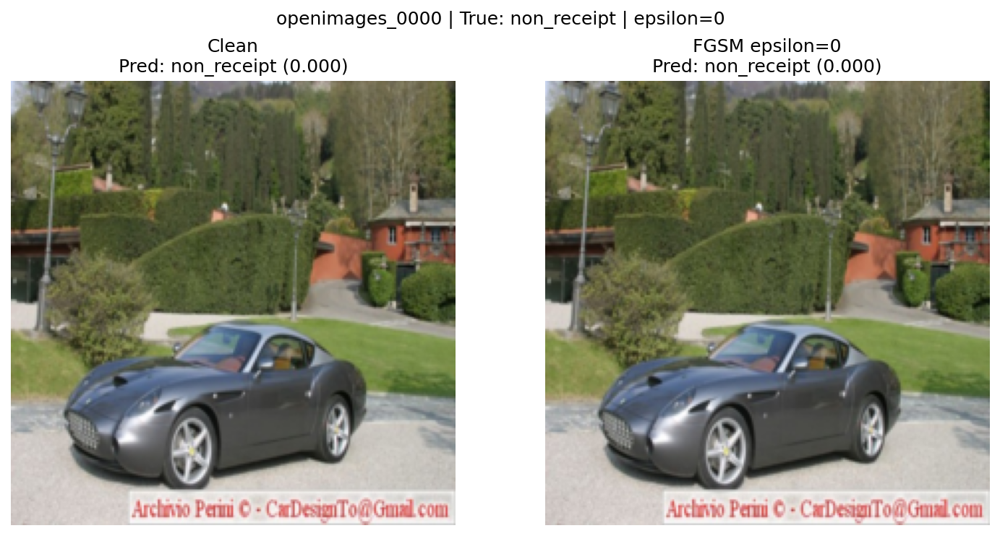
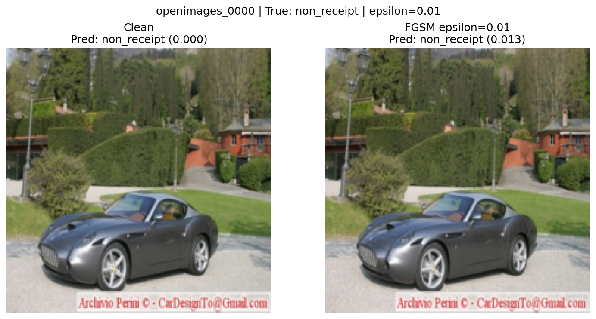
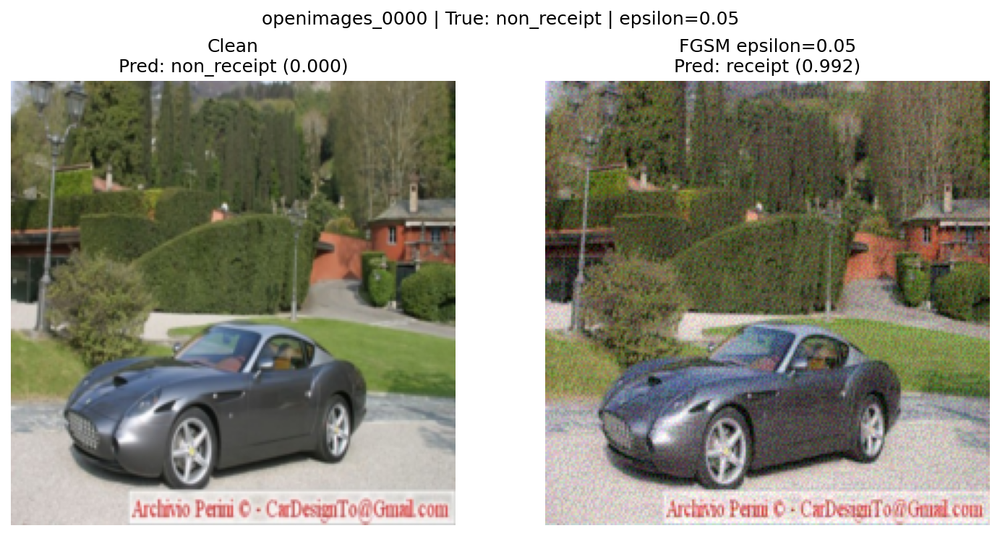
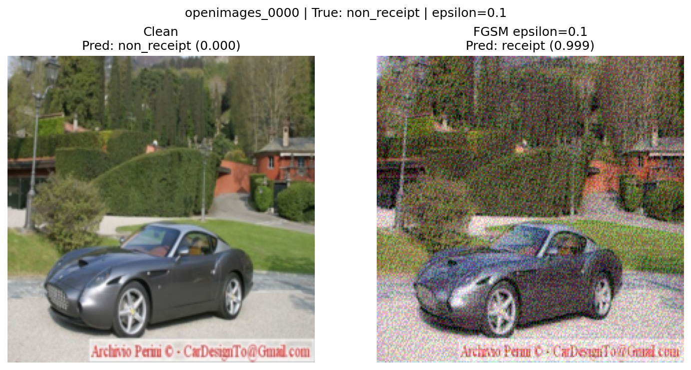
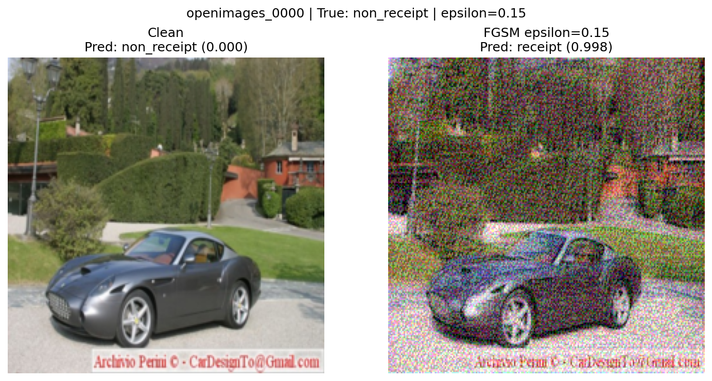

# FGSM Evasion Attack Results

## Clean Model Baseline

- **Model:** ReceiptCNN (3 conv layers with BatchNorm, GAP, 26K parameters)
- **Test accuracy:** 97.44%
- **Precision:** 98.43% | **Recall:** 96.41% | **F1:** 97.41%
- **FGSM baseline:** At epsilon 0.000, the adversarial image is identical to the clean image. Accuracy remains 97.44% and attack success is 0.00%, confirming that later degradation comes from the perturbation rather than from the evaluation loop.

## FGSM Results (Clean Model)

| Epsilon | Clean Accuracy | Adversarial Accuracy | Attack Success Rate |
|---------|---------------|---------------------|-------------------|
| 0.000 | 97.44% | 97.44% | 0.00% |
| 0.010 | 97.44% | 88.72% | 8.95% |
| 0.030 | 97.44% | 64.62% | 33.68% |
| 0.050 | 97.44% | 41.79% | 57.11% |
| 0.100 | 97.44% | 19.23% | 80.26% |
| 0.150 | 97.44% | 16.67% | 82.89% |

*Attack Success Rate = fraction of correctly classified samples flipped by FGSM perturbation*

## Visual Evidence

The following images show the same sample evaluated at each epsilon. Each figure compares the clean image against the FGSM-perturbed version and records the clean/adversarial model prediction.

## Analysis

1. **Baseline behavior is stable:** With epsilon 0.000, the clean and adversarial evaluations match exactly. This establishes a clean reference point: the classifier performs well on unmodified test images, but that performance is not robust once gradient-based perturbations are introduced.

2. **Early attack effectiveness:** At epsilon 0.010, adversarial accuracy drops from 97.44% to 88.72%. The image still appears visually close to the original, which is the attacker-preferred region: the perturbation is small enough to avoid obvious human suspicion but already causes measurable model failure.

3. **Steep degradation curve:** Accuracy drops below 50% by epsilon 0.050. This is the point where FGSM becomes highly damaging: 57.11% of previously correct classifications are flipped.

4. **Visible degradation threshold:** The images begin to show more noticeable noise around epsilon 0.100 and 0.150. A human reviewer would be more likely to notice changes at those levels, but the model is already badly compromised before then.

5. **Near-complete evasion at epsilon 0.100:** The model retains only 19.23% adversarial accuracy, with over 80% of previously correct predictions flipped by the attack.

6. **Plateau effect:** Beyond epsilon 0.100, additional perturbation yields diminishing returns. The model is already near-random performance, so increasing epsilon mostly makes the image more suspicious without a proportional attack benefit.

## Implications

The receipt classifier has no built-in robustness to adversarial inputs. An attacker could submit a slightly modified non-receipt image that the model confidently classifies as a valid receipt, potentially enabling expense fraud. The perturbations at epsilon 0.010 to 0.030 are the most concerning because they preserve plausible visual quality while still causing a substantial drop in classifier reliability.
