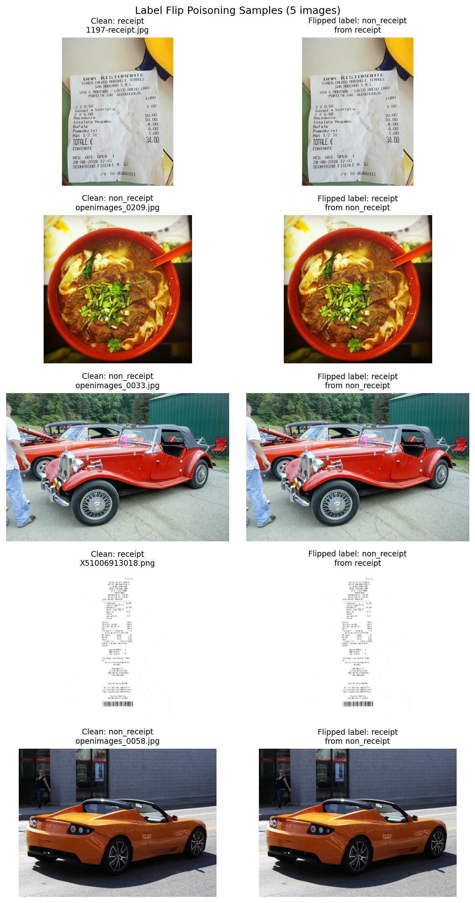
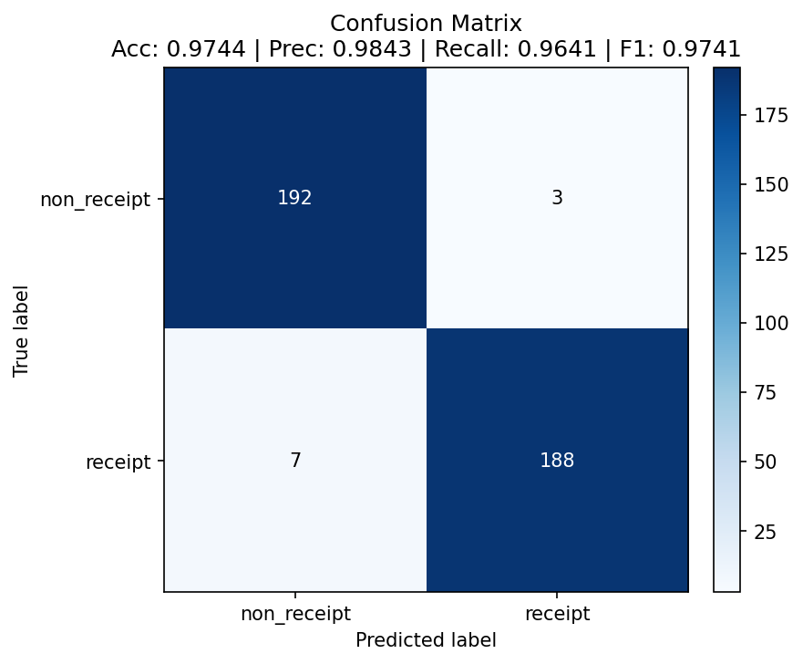
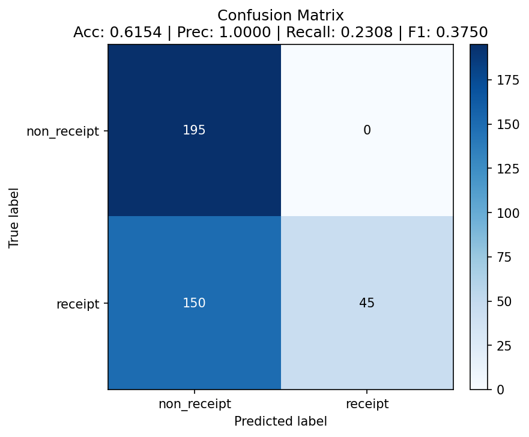

# Data Poisoning Results

## Attack Configuration

- **Method:** Label-flip poisoning
- **Flip rate:** 5% target (4.85% effective — see note below)
- **Labels flipped:** 56 unique mislabels out of 1,154 training images
- **Note:** The script reports "Labels flipped: 58" and "Total training images: 1182" because iteration 2 re-samples the destination class after iteration 1 has already moved files into it. One file is moved twice (ending up correctly labeled again), and the moved-in files are double-counted in the total. The on-disk truth is 56 unique mislabels across 1,154 training images. The trained checkpoint and metrics below reflect this on-disk state.
- **Test set:** Unchanged clean test set with 195 non-receipt and 195 receipt images
- **Goal:** Corrupt a small portion of training labels so the retrained classifier learns a distorted boundary while evaluation remains on clean data.

## Label Flip Evidence

The visualization below samples five poisoned training examples. Each row shows the original clean training image and the copied/moved poisoned version with the opposite label. This confirms the poisoning mechanism is not altering pixels; it is changing the class assignment used during training.

## Baseline (Clean Model)

| Metric | Value |
|--------|-------|
| Accuracy | 97.44% |
| Precision | 98.43% |
| Recall | 96.41% |
| F1 Score | 97.41% |
| Confusion Matrix | TN=192 FP=3 / FN=7 TP=188 |

The clean model is a strong baseline. It correctly classifies 380 of 390 test images, with only 3 false positives and 7 false negatives. Both precision and recall are high, so the model is not simply favoring one class; it performs reliably on both receipts and non-receipts before poisoning.

## Poisoned Model

| Metric | Value |
|--------|-------|
| Accuracy | 61.54% |
| Precision | 100.00% |
| Recall | 23.08% |
| F1 Score | 37.50% |
| Confusion Matrix | TN=195 FP=0 / FN=150 TP=45 |

The poisoned model has a very different error profile. It classifies every non-receipt correctly, but rejects 150 of 195 real receipts. This means the model has learned a strong bias toward the non-receipt class after training on the corrupted labels.

## Impact Analysis

| Metric | Clean | Poisoned | Change |
|--------|-------|----------|--------|
| Accuracy | 97.44% | 61.54% | **-35.90pp** |
| Precision | 98.43% | 100.00% | +1.57pp |
| Recall | 96.41% | 23.08% | **-73.33pp** |
| F1 | 97.41% | 37.50% | **-59.91pp** |

## Key Findings

1. **Small poisoning volume caused large damage:** Less than 5% label corruption (56/1,154 ≈ 4.85%) caused a 35.90 percentage point accuracy drop. This far exceeds the project threshold for a meaningful poisoning impact.

2. **The attack primarily damaged receipt recall:** Clean recall was 96.41%, but poisoned recall fell to 23.08%. In practical terms, the poisoned model rejects most valid receipts.

3. **Precision is misleading by itself:** The poisoned model reports 100.00% precision because it only predicts "receipt" for 45 cases and all 45 are correct. That does not mean the model is healthy; the confusion matrix shows it avoids the receipt class almost entirely.

4. **The confusion matrices show asymmetric failure:** The clean model makes small errors in both directions. The poisoned model makes no false-positive errors, but it creates 150 false negatives. This confirms that the label flip attack shifted the decision boundary instead of creating random noise.

5. **The label-flip graphic validates the root cause:** The sampled images demonstrate that the attack did not need to modify image content. The training signal was corrupted simply by moving images into the opposite class folder with a `flipped_` prefix.

## Implications

A malicious actor with access to a small portion of the training pipeline could effectively disable the receipt classifier for legitimate users. The most likely business impact is denial of service: valid reimbursement submissions would be rejected at high volume. Because the attack preserves image content and only changes labels, it would be difficult to detect without dataset integrity checks, provenance tracking, or review of class-folder movement before training.
